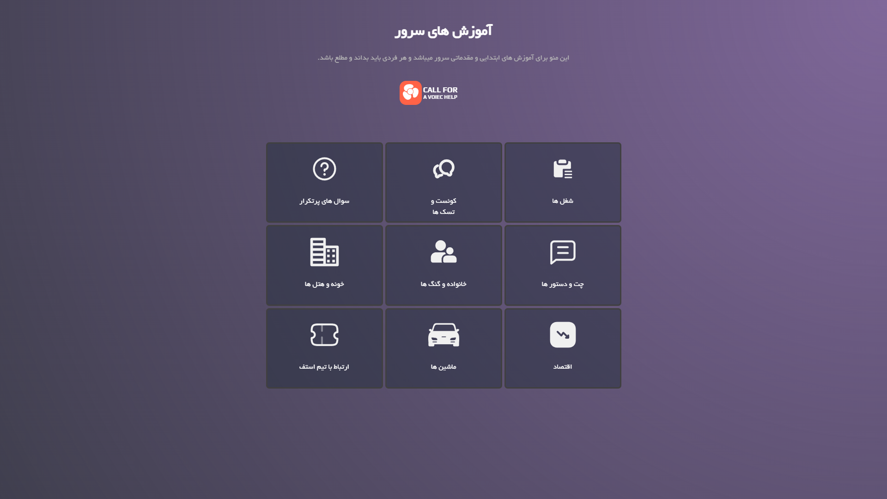
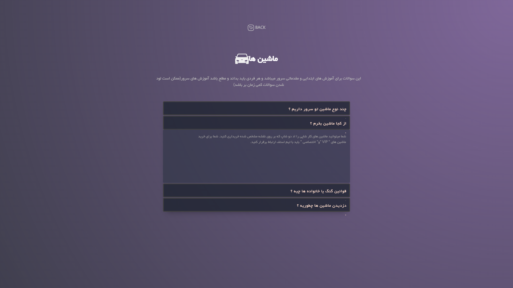

<div align="center" dir="rtl">

# 🌟 سیستم راهنمای Persian City

[](https://github.com/Code1616/Fivem-help-menu/issues)
[](https://choosealicense.com/licenses/mit/)
[](https://github.com/Code1616/FIivem-help-menu)

</div>

<div dir="rtl">

## 📖 درباره پروژه
سیستم جامع راهنما و آموزش برای بازیکنان سرور Persian City. این پروژه با هدف ارائه اطلاعات کامل و دسته‌بندی شده برای کاربران جدید و قدیمی طراحی شده است.

## ✨ ویژگی‌های اصلی
- 🎯 راهنمای قدم به قدم برای شروع
- 📱 طراحی واکنش‌گرا (Responsive)
- 🔍 جستجوی پیشرفته در محتوا
- 🌙 پشتیبانی از حالت شب/روز
- 🔄 به‌روزرسانی خودکار محتوا
- 💬 پشتیبانی از چندزبانگی

## 🔧 تکنولوژی‌ها و پیش‌نیازها
- Node.js v14+
- React.js v17+
- Font Awesome v5
- Webpack v5
- CSS3/SASS
- HTML5

## ⚙️ نصب و راه‌اندازی

### پیش‌نیازها
```bash
# نصب Node.js
winget install OpenJS.NodeJS.LTS

# نصب وابستگی‌های جهانی
npm install -g yarn
```

### مراحل نصب
```bash
# کلون پروژه
git clone https://github.com/Code1616/Fivem-help-menu.git

# نصب وابستگی‌ها
cd Fivem-help-menu
yarn install

# اجرای محلی
yarn dev

# ساخت نسخه تولید
yarn build
```

## 🎮 راهنمای استفاده

### بخش‌های اصلی
1. **صفحه اصلی**: معرفی و دسترسی سریع
2. **راهنمای شغل‌ها**: اطلاعات مشاغل و درآمدزایی
3. **سیستم مسکن**: راهنمای خرید و اجاره
4. **گنگ‌ها و خانواده‌ها**: مدیریت گروه‌ها
5. **دستورات**: لیست کامل دستورات و کلیدها
6. **اقتصاد**: راهنمای سیستم اقتصادی
7. **ارتباط با ادمین**: سیستم تیکت و پشتیبانی

### کدهای میانبر
| کلید | عملکرد |
|------|---------|
| F1 | منوی اصلی |
| F2 | جستجو |
| F3 | تنظیمات |
| ESC | بازگشت |

## 🖼️ اسکرین‌شات‌ها
<div align="center">
  
  <p>نمای اصلی</p>
  
  
  <p>نمایی از منوی راهنما</p>
</div>

## 👥 مشارکت در توسعه

### گردش کار Git
```bash
# ایجاد برنچ جدید
git checkout -b feature/your-feature

# کامیت تغییرات
git commit -m "feat: add new feature"

# پوش به مخزن
git push origin feature/your-feature
```

### استانداردهای کد
- استفاده از ESLint
- پیروی از Conventional Commits
- تست‌نویسی برای تغییرات جدید
- مستندسازی API‌ها

## 🧪 تست‌ها
```bash
# اجرای تست‌ها
yarn test

# اجرای تست با پوشش
yarn test:coverage
```

## 📄 مجوز
این پروژه تحت مجوز MIT منتشر شده است. برای جزئیات بیشتر LICENSE را مطالعه کنید.

## 📞 ارتباط و پشتیبانی
- 🌐 وبسایت: [persian-city.com](https://RobixCM.ir)
- 📧 ایمیل: info@robixcm.ir

## ⭐ حمایت از پروژه
اگر این پروژه برایتان مفید بود:
1. به پروژه ستاره دهید
2. آن را به دوستانتان معرفی کنید
3. در توسعه آن مشارکت کنید
4. باگ‌ها را گزارش دهید

</div>

---

<div align="center" dir="rtl">
🚀 توسعه داده شده  Roozbeh
</div>
``` 
